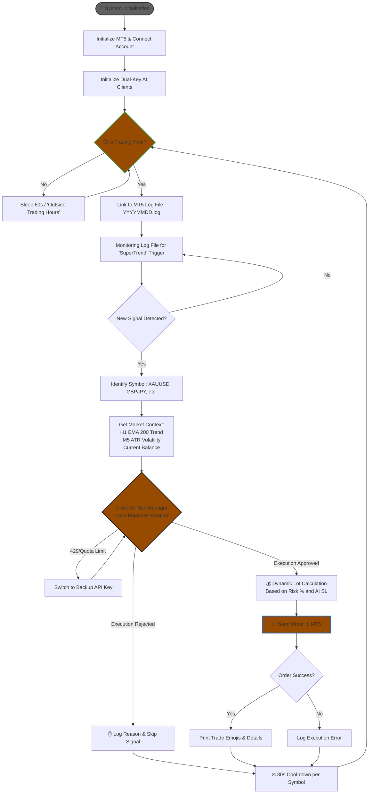

# 🤖 XAUUSD SMC AI Trading Agent
Autonomous Gold Trading via LLM Reasoning & Smart Money Concepts
This repository contains a sophisticated AI Trading Agent that automates Gold (XAUUSD) trading. It bridges the gap between algorithmic technical analysis and human-like reasoning by using Google Gemini 1.5/2.5 Flash to validate Smart Money Concept (SMC) setups.

# 🌟 Key Highlights
- **Cognitive Analysis:** Uses LLM-based reasoning to validate signals, filtering out "inducement" and low-probability traps.

- **SMC Framework:** Built on Smart Money Concepts, specifically identifying and trading unmitigated M5 Order Blocks.

- **Multi-Timeframe Trend Engine:** Uses a dual-layered filter (M15 Trend EMA 50 + M5 Momentum Health) to ensure alignment with institutional flow.

- **Dynamic Risk Management:** Automatically calculates position sizing for a strict 5% account risk model with a 1:2 Risk-to-Reward ratio.

- **Resilient Design:** Includes an API key rotation system and local log-monitoring for real-time market perception.

# 🚀 How It Works
- **Perception:** A dedicated MQL5 Indicator monitors price action and writes high-interest Order Block signals to local MT5 logs.

- **Contextual Analysis:** The Python Agent detects the signal, pulls live M5 and M15 data, and performs technical filtering.

- **Cognitive Reasoning:** The agent sends the full market context (ATR, Trend, Price Action) to the Gemini AI "Brain" for a final Go/No-Go decision.

- **Execution:** Upon approval, the agent calculates the lot size and executes the trade via the MetaTrader 5 API with automated SL/TP.

# 🛠️ Prerequisites & Setup
**1. MetaTrader 5 Indicator**
- This agent requires an external "sensor" to generate signals.

- **Required Indicator:** https://www.mql5.com/en/market/product/107329

**Installation:**

- Download and install the indicator via the MQL5 Market.

- Attach the indicator to your XAUUSD M5 chart.

In the indicator settings, ensure Alerts are enabled so signals are written to the terminal logs.

# 3. How to run the system
**. Environment Configuration**
1. **Clone the repo:**
   ```bash
   git clone https://github.com/MSam-data/XAUUSD-SMC-AI-Agent.git
   cd XAUUSD-SMC-AI-Agent

2. **Install dependencies**
- `pip install -r requirements.txt`

3. **Find .env file**
add your API keys and log file root folder as:
- `GEMINI_KEY_1=your_first_api_key`
- `GEMINI_KEY_2=your_second_api_key`
- `MT5_LOG_PATH=C:\Users\YourUser\AppData\Roaming\MetaQuotes\Terminal\...\MQL5\Logs`

4. **Run the application**
`python XAUUSD_ai_m5_strategy_agent.py`

## The project workflow.


